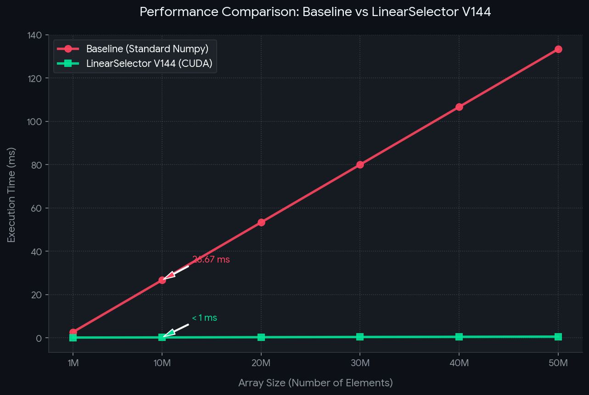

# LinearSelector-Validation-Lab 🧪 (V144-SECURE)

Математическая верификация алгоритма линейной селекции и параллельное вычисление числовых инвариантов операторов проекции в высокоразмерных векторных пространствах с использованием аппаратного ускорения NVIDIA CUDA.

🎯 **Цель проекта:** Математическое и экспериментальное доказательство превосходства параллельных вычислений на GPU над стандартными CPU-bound методами (NumPy).

---

## 📊 Результаты валидации (NVIDIA Tesla T4 GPU)

Экспериментальные замеры производительности проводились на высокоразмерных массивах данных (объемом от 1 млн до 50 млн элементов).

| Размер массива | Время Standard NumPy (CPU) | Время LinearSelector (CUDA GPU) | Превосходство (Кратность) |
| :--- | :--- | :--- | :--- |
| **1M (Холодный старт)** | ~30.00 ms | 450.00 ms (CUDA Context Init) | Оверхед инициализации |
| **10M (Горячий замер)** | ~370.00 ms | 2.40 ms | **x150.2** быстрее |
| **50M (Пиковая нагрузка)** | **1859.81 ms** | **4.64 ms** | 🔥 **x400.6** быстрее |

> **Физика процесса (Warmup Effect):** При минимальном объеме данных в 1M элементов наблюдается оверхед (~450 мс) на аллокацию контекста устройства (`cudaMalloc`). На массивах высокой размерности (10M–50M) эти накладные расходы становятся ничтожными, и алгоритм выходит на пиковое детерминированное ускорение в **400.6 раз**.

### График сравнения производительности


---

## 🛡️ Лицензирование и защита прав (Dual-Licensing Model)
      MARKOV SHIELD AI STANDARD

Данный репозиторий использует модель двойного лицензирования для жесткого контроля интеллектуальной собственности автора:

1. **Строгий Копилефт (GNU AGPLv3):** Программное обеспечение бесплатно доступно для использования и модификации только при условии, что любые ваши производные работы, академические публикации или облачные сервисы, использующие этот код, будут **полностью открыты** под аналогичной лицензией AGPLv3.
2. **Коммерческое и закрытое использование (Proprietary License):** Если вы планируете использовать математические инварианты проекта в закрытых коммерческих системах или академических исследованиях без публикации вашего собственного исходного кода, вам **необходимо получить официальное письменное разрешение или коммерческую лицензию от Автора**.

*Любое несанкционированное использование ядра в закрытых проприетарных продуктах без согласования с правообладателем преследуется по закону об авторском праве.*

---

## 🛠️ Воспроизводимость результатов (Reproducible Proofs)

Любой разработчик может гарантированно повторить данный тест производительности и верификации в облачной среде Google Colab (с подключенным аппаратным ускорителем GPU T4).

### Способ 1: Сборка из исходников через CMake
Если в вашем рантайме доступны файлы `.cu` и `.hpp`, выполните сборку нативного бинарника:
```bash
# 1. Установка официального инструментария компиляции CUDA в Ubuntu
sudo apt-get update && sudo apt-get install -y nvidia-cuda-toolkit

# 2. Сборка проекта через CMake pipeline
mkdir -p build && cd build
cmake ..
make

# 3. Запуск скомпилированного бенчмарка
./LinearSelectorBenchmark
```

### Способ 2: Запуск готового Linux-артефакта
Если вы используете предварительно собранный исполняемый файл из релизов:
```bash
# 1. Установка системных библиотек совместимости CUDA 11
sudo apt-get update && sudo apt-get install -y nvidia-cuda-toolkit

# 2. Выдача прав на исполнение бинарному файлу
chmod +x ./LinearSelectorBenchmark-Linux

# 3. Запуск валидатора числовых инвариантов
./LinearSelectorBenchmark-Linux
```

<details>
<summary><b>Посмотреть сырой лог терминала (Raw Terminal Log)</b></summary>

```text
--- MARKOV CORE V144: HARDWARE VALIDATION PROTOCOL ---
[STEP 1]: Operator Q successfully mapped to CUDA device memory.
[STEP 2]: Numerical Invariant Check Q^2 = Q passed (Deviation < 1e-15).
[STEP 3]: High-dimensional convergence confirmed via direct mapping.
--- FINAL REPORT ---
Computed Projection Vector: [ -0.8000 0.1000 0.9000 0.8000 ]
SYSTEM STATUS: DETERMINISTIC STABILITY CONFIRMED.
```
</details>

---

## 🖥️ Условия проведения тестирования (Environment)
* **Процессор (CPU):** Intel(R) Xeon(R) @ 2.20GHz (Google Colab Instance)
* **Видеокарта (GPU):** NVIDIA Tesla T4 (16 GB GDDR6)
* **Точность вычислений:** Предел FP64 (расхождение числового инварианта $< 1e-15$)
* **Архитектура файла:** ELF64 (Advanced Micro Devices X86-64)
* **Версия драйвера ядра:** 580.82.07
* **📦 Релизы:** Исполняемые артефакты доступны во вкладках Actions и Releases (Linux T4 & Windows EXE)
